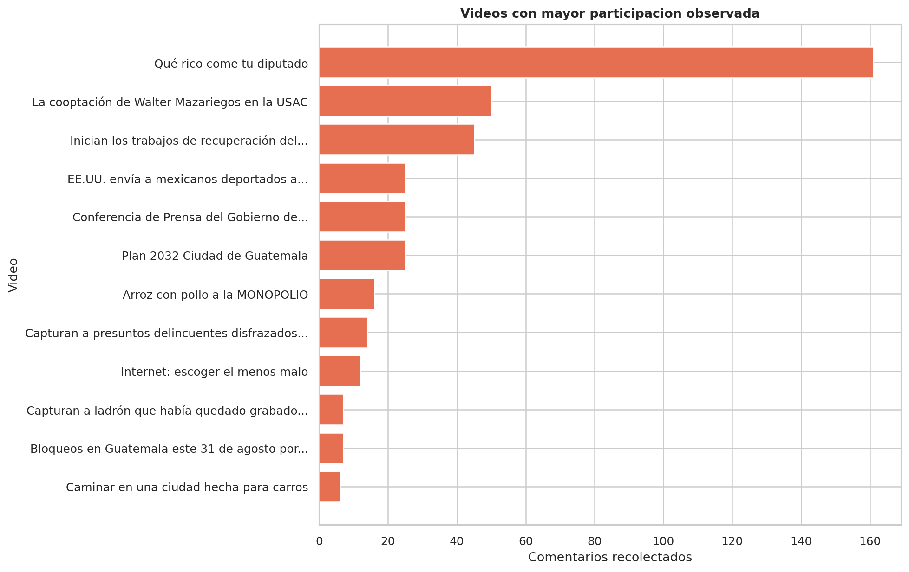
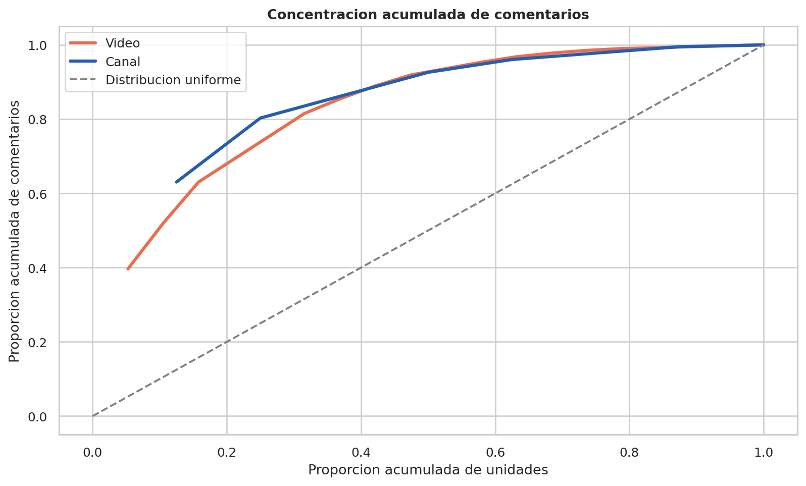
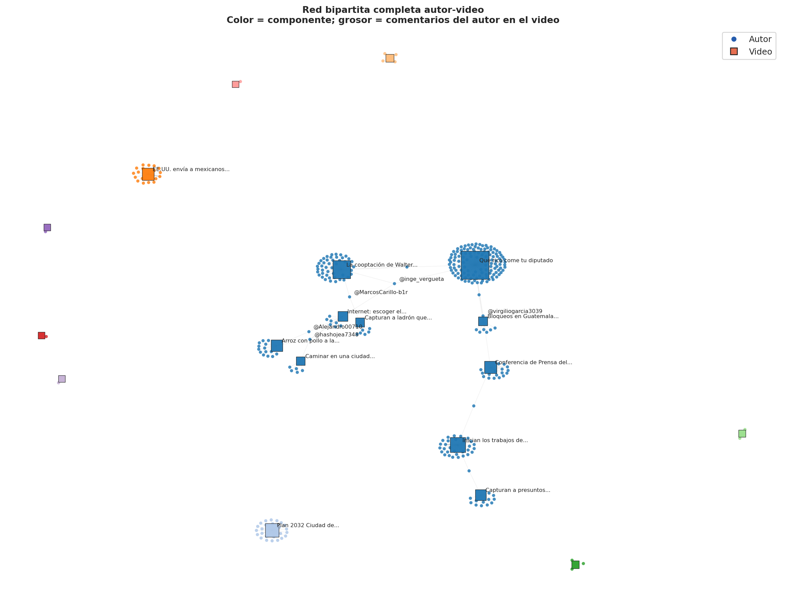

# Laboratorio 6 - Analisis de redes sociales: YouTube

## Informe de avance: actividades 1 a 4

**Autor:** Daniel Adolfo Sarmiento Peralta  
**Curso:** CC3084 - Data Science  
**Fecha de generacion:** 2026-09-03

## Resumen

- Videos: 293
- Canales: 97
- Comentarios: 406
- Autores: 332
- Comentarios asociados mediante `video_id`: 406 de 406
- Red bipartita: 351 nodos y 343 aristas

## 1. Carga, comprension e integracion

`youtube_videos.csv` tiene como unidad un video y llave primaria `video_id`.  
`youtube_comments.csv` tiene como unidad un comentario principal y llave primaria `comment_id`; `video_id` es llave foranea.

La union muchos-a-uno asocio 406 comentarios. Los ID se mantienen como identificadores y los nombres/handles como etiquetas.

## 2. Calidad, limpieza y preprocesamiento

Se conservaron `texto_original` y `texto_limpio`. La limpieza usa Unicode NFKC, minusculas, separacion de hashtags, eliminacion de URL, menciones, puntuacion, numeros, emojis y stopwords. No se aplico lematizacion para evitar una dependencia linguistica externa no incluida en el entorno reproducible.

Las tablas completas estan en `resultados/tablas/`, incluyendo faltantes, tipos, atipicos IQR, consistencia de identificadores y efecto de limpieza.

## 3. Analisis exploratorio

El video con mayor participacion es **Qué rico come tu diputado**, con 161 comentarios. Las figuras cuantifican canales, videos, concentracion, relacion vistas-comentarios, palabras, bigramas, categorias y sentimiento preliminar.

## 4. Red bipartita autor-video

Cada arista conecta un `author_channel_id` con un `video_id` cuando el autor publico al menos un comentario principal. Su peso es el numero de comentarios del autor en ese video. No representa amistad, respuesta directa ni aprobacion.

## Limitaciones

- Cobertura parcial de comentarios y seleccion por consultas/canales.
- Fechas relativas en comentarios.
- Conteos observados en un momento de recoleccion.
- `reply_count` no identifica autores de respuestas.
- Participacion concentrada en pocos videos.
- Los resultados describen la muestra y no se generalizan a toda la poblacion de Guatemala o YouTube.
